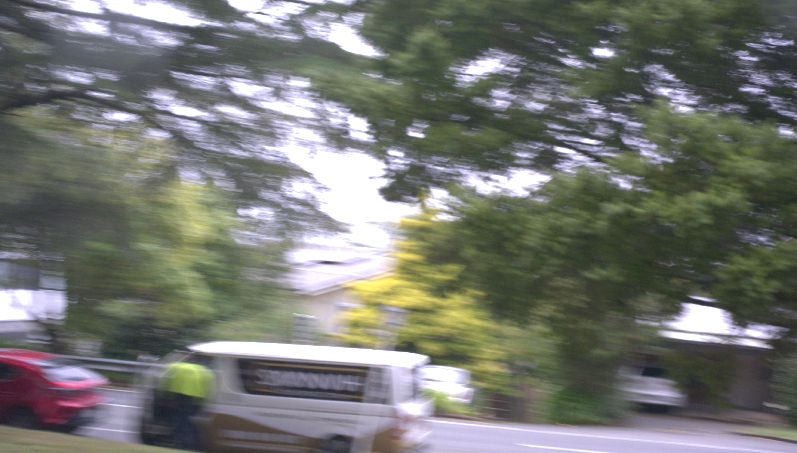
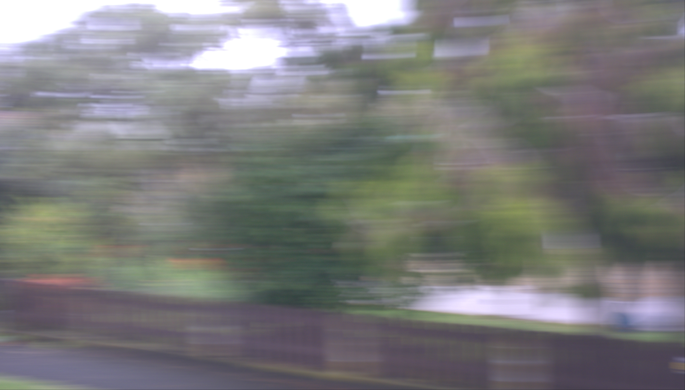
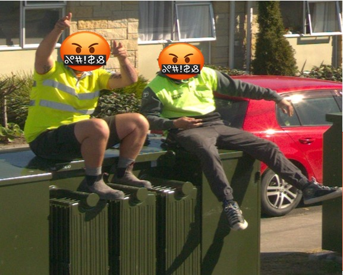

# Image Filters for Data Preprocessing

In the expansive field of digital imaging and data analysis, the transformation of raw image datasets into prepared, analyzable formats is paramount. The preprocessing stage plays a crucial role in this transformation, managing and refining vast volumes of data to retain only the most relevant and high-quality images. This not only streamlines the subsequent analytical processes but also significantly enhances the accuracy and reliability of the findings.

Within this folder, we introduce three specialized filtering techniques, each dedicated to addressing common yet critical issues encountered during image dataset preparation:

- Blur Images Filter: Targets and removes blurred images, which may result from camera movement, improper focus, or environmental factors, ensuring the dataset comprises only sharp and clear images.

- Privacy Protection Filter: Identifies and blurs out sensitive information within images, such as faces and license plates, addressing privacy concerns and adhering to ethical standards.

- Similar Images Filter: Detects and filters out nearly identical images, reducing redundancy and focusing the dataset on unique visual data.

 

## Directory Structure

This repository is structured into three main subfolders, each corresponding to one of the filtering techniques:

- blur_images_filter: Contains scripts and documentation for detecting and filtering blurred images using methods like [Fast Fourier Transform (FFT)](https://github.com/Sami3610/BioVison/tree/main/Filters/Blur_images_filter/FFT) and [Laplacian Variance](https://github.com/Sami3610/BioVison/tree/main/Filters/Blur_images_filter/Laplacian_Variance).
- privacy_filter: Houses the tools and guidelines for blurring sensitive information within images, leveraging the YOLOv5 model for object detection.
- similar_images_filter: Includes methods for identifying and removing nearly identical images from the dataset, employing techniques such as [Mean Square Error (MSE)](https://github.com/Sami3610/BioVison/tree/main/Filters/Similar_image_filter/similarity.detection_MSE) and [Normalized Cross-Correlation (NCC)](https://github.com/Sami3610/BioVison/tree/main/Filters/Similar_image_filter/similarity.detection_NCC).

## Getting Started

To begin utilizing these filters, we recommend navigating to each subfolder where detailed instructions on installation, configuration, and execution are provided. These guidelines will assist you in deploying each technique effectively to enhance your image dataset's quality and relevance.

## Contributing

We value contributions that improve the functionality, accuracy, and efficiency of these filters. If you have suggestions or enhancements, please fork this repository, commit your changes, and submit a pull request for review.

## License

This project and all its subcomponents are licensed under the MIT License. For more details, see the LICENSE file in each subfolder.

## Acknowledgments

Our heartfelt thanks go out to all contributors and the broader community of researchers and developers in digital image processing. Your innovative work and tools have significantly contributed to the development of these filtering techniques.