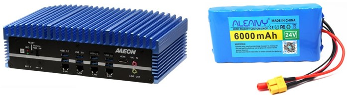
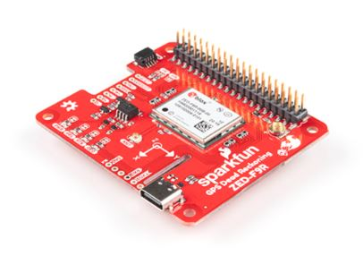

# Hardware Components of BioVison

## Overview

Welcome to the overview of the Hardware Components of the BioVision Imaging System. Detailed insights into the sophisticated hardware suite, that powers our urban vegetation mapping solution, are provided in this document. Designed for operation in diverse and challenging urban environments, high-quality visual data essential for comprehensive ecological analysis is captured by our system. Descriptions and visual representations of each key component, demonstrating their role and significance in achieving the system's objectives, will be found below

*Figure: Detailed view of the Biovision Imaging System's hardware setup, showcasing the integration of key components.*

## A and B. Camera and lens
The Basler a2A5320-23ucBAS camera, equipped with a Sony IMX542 CMOS sensor, is characterized by its high-resolution imaging capability of up to 5328 x 3040 pixels, making it ideal for the detailed capture of urban vegetation. With its capability to operate at 23 frames per second, this 16.1-megapixel RGB camera is well-suited for urban environments, being adaptable to dynamic lighting and motion conditions. When paired with a 12mm lens, the widest field of view necessary for documenting the extensive details of urban canopies is provided. This setup ensures that comprehensive coverage and detailed capture are achieved, which are crucial for the objective of compiling a detailed visual inventory of urban vegetation, establishing the 12mm lens and the Basler camera as core components of the imaging system.

*Figure: Camera and Lens*

## C and D. Computer and Batteries
The computational core of the data collection system is the BOXER-6641-A1, a fanless industrial computer from AAEON (Taiwan). For reliable and continuous operation during field data acquisition, the system was powered by two batteries, each with a capacity of 30000 mAh. The computer is powered by an Intel(R) Core (TM) i7-8700T CPU @ 2.40GHz and is equipped with 32 GB of installed memory (RAM), alongside an Intel(R) UHD Graphics 630 GPU. This setup provides substantial processing power necessary for the imaging tasks. Its fanless design contributes to reduced mechanical wear and enhanced longevity. Furthermore, the system is capable of operating across a wide voltage range from 10V to 35V and can withstand a broad temperature spectrum from -20°C to 55°C, which is essential for maintaining operational stability in diverse urban environments.

*Figure: Computer and Battery*

## E and F. GPS module and antenna
Alongside the hardware dedicated to imaging, a GPS module is necessary to record the geographical coordinates of each photograph. In this imaging system, the u-blox ZED-F9R-00B module and a GPS antenna were employed for recording GPS coordinates.

*Figure: GPS module and antenna*

## G. Wi-Fi router 
The last component of the imaging system's hardware is the TP-Link TL-WR703N (China), a compact wireless router. This device serves as a critical link between the computer and the operator's laptop. The TL-WR703N is configured to create a local Wi-Fi network, to which the laptop can connect. Once this wireless connection is established, the laptop gains access to the imaging system computer's interface, enabling remote operation and monitoring of the imaging system. This setup is particularly advantageous for fieldwork, as it allows for flexibility and mobility, eliminating the need for direct physical interaction with the imaging system's computer for system adjustments or data retrieval.

*Figure: Wi-Fi router*

