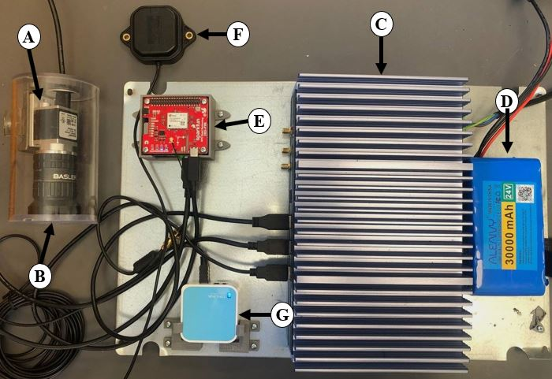
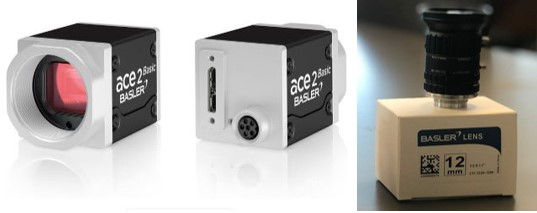

# Hardware Components of BioVison

## Overview

The Biovision Imaging System's hardware suite for diverse and challenging conditions encountered in urban environments ensures the capture of high-quality visual data that is crucial for in-depth and comprehensive ecological analysis. This robust suite encompasses a carefully curated selection of components, each chosen for its reliability, performance, and contribution to the system's overall goal of creating an unparalleled urban vegetation mapping solution. Key components of this sophisticated hardware setup include:

*Figure: Detailed view of the Biovision Imaging System's hardware setup, showcasing the integration of key components.*

## A and B. Camera and lens
The Basler a2A5320-23ucBAS camera, equipped with a Sony IMX542 CMOS sensor, is characterized by its high-resolution imaging capability of up to 5328 x 3040 pixels, making it ideal for the detailed capture of urban vegetation. With its capability to operate at 23 frames per second, this 16.1-megapixel RGB camera is well-suited for urban environments, being adaptable to dynamic lighting and motion conditions. When paired with a 12mm lens, the widest field of view necessary for documenting the extensive details of urban canopies is provided. This setup ensures that comprehensive coverage and detailed capture are achieved, which are crucial for the objective of compiling a detailed visual inventory of urban vegetation, establishing the 12mm lens and the Basler camera as core components of the imaging system.

*Figure: Camera and Lens*

## C and D. Computer and Batteries
The computational core of the data collection system is the BOXER-6641-A1, a fanless industrial computer from AAEON (Taiwan) . For reliable and continuous operation during field data acquisition, the system was powered by two batteries, each with a capacity of 30000 mAh. The computer is powered by an Intel(R) Core (TM) i7-8700T CPU @ 2.40GHz and is equipped with 32 GB of installed memory (RAM), alongside an Intel(R) UHD Graphics 630 GPU. This setup provides substantial processing power necessary for the imaging tasks. Its fanless design contributes to reduced mechanical wear and enhanced longevity. Furthermore, the system is capable of operating across a wide voltage range from 10V to 35V and can withstand a broad temperature spectrum from -20°C to 55°C, which is essential for maintaining operational stability in diverse urban environments.

